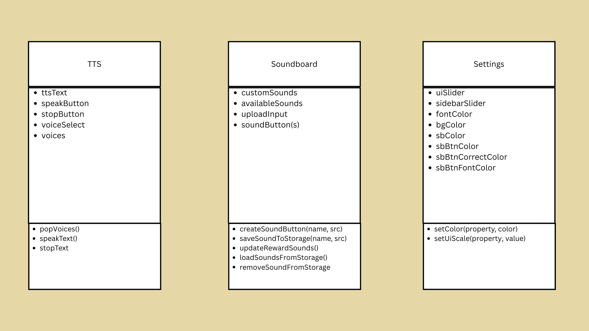

# GPAA

Welcome to our Special Education General Accommodation App!

## Group Members
* Naudia De Arte
* Emmanuel De Guzman

## Requirements
This project grabs voices from your OS system, as well as your browser. For the best performance, you may want to use Google Chrome. Works with both Windows and Linux Distributions.

## Diagrams

### Use Case Diagram

### Activity Diagram

### UML CRC Diagram

## About the App
The app is a way for SPED student to communicate, express and accommodate for whatever they may need, from soundboard, to TTS, to a tokenboard, to even a whiteboard. Users have the ability to create their own tokenboard stickers, have their own customizable soundboard, draw on a whiteboard that can be used for school work, and communicate 

## Text-to-Speech (TTS)

## Token Board

This creates a token board for students who use a token economy in order to help reinforce their good behavior! 5 tokens, with supervision, allows them to win their award!

## Whiteboard

This is a white board for students! This allows a student to use their whiteboard!

## General Settings
